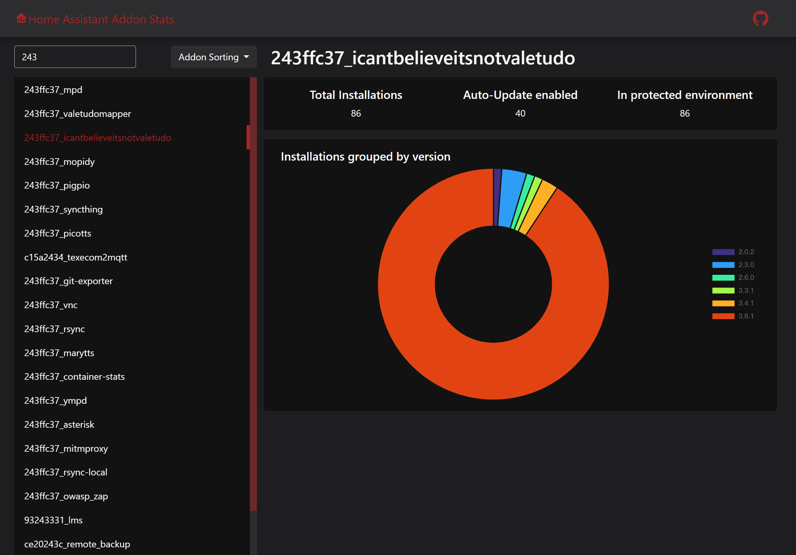

# Home Assistant Addon Stats

An alternative frontend for the [official addon statistics from Home Assistant](https://analytics.home-assistant.io/#add-ons) which shows
all available addons.

The official side is filtered to the self-managed addons. This little Vue page will use the same data and shows an overview without this
filter.

## Setup

Before building download the latest addons.json from https://analytics.home-assistant.io/addons.json and place it in the public folder.

The project is build by `vite`. After checkout make sure you have at least the latest lts version of node and install the packages
with `npm i`. After that the artefact directory `dist` can be build with `npm run build`. For more predefined scripts look at
the `package.json`.
